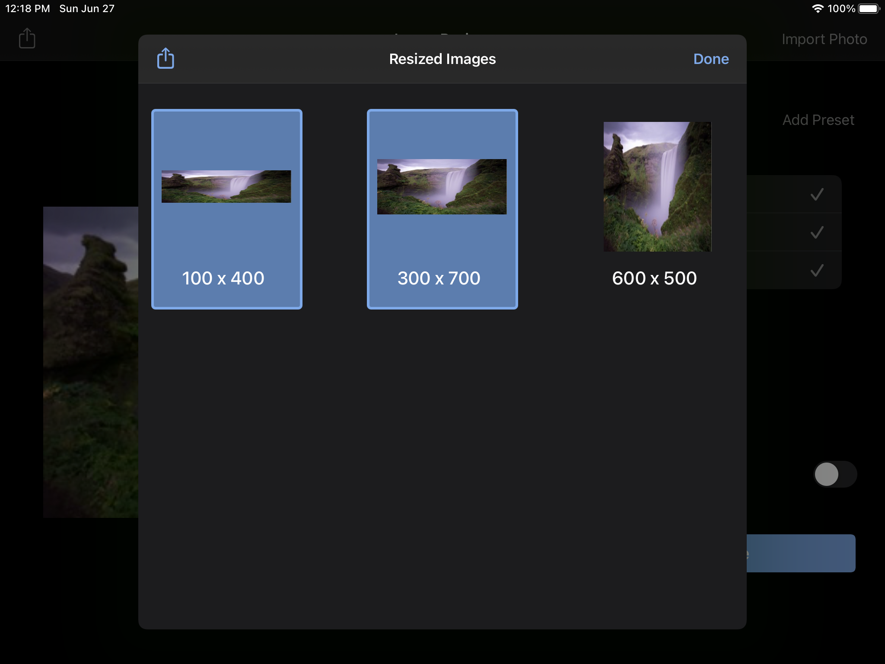
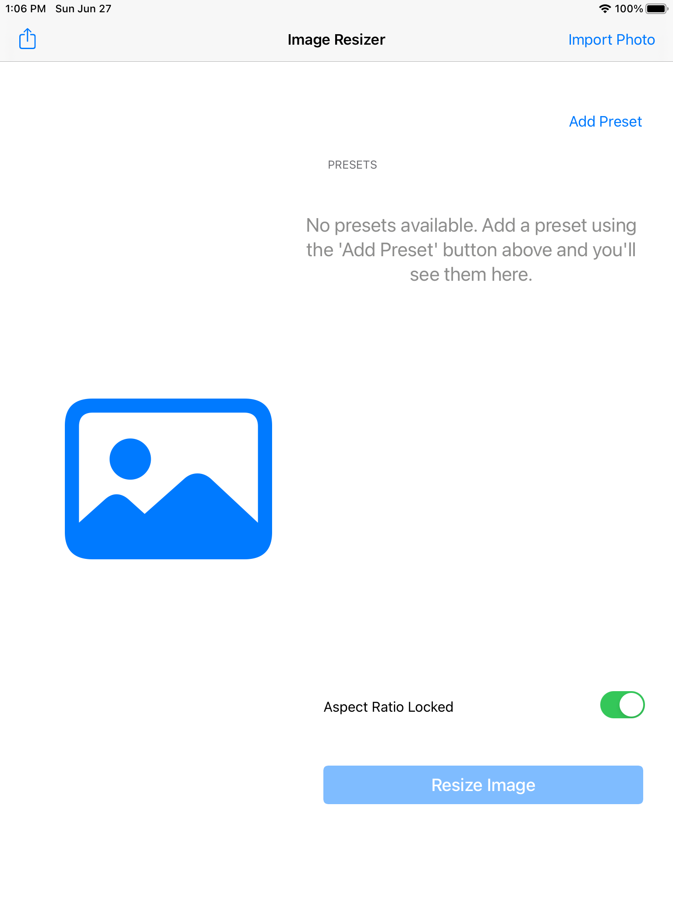

# imageResizer

  

With imageResizer, you can resize any image with the click of a button! It's available on the iPad and Mac, and is perfect for creating app icons of multiple sizes.

#Features

- can lock aspect ratio if you want to mantain the aspect ratio of your image, while trying to conform to your selected dimensions

- can share resized images with others
